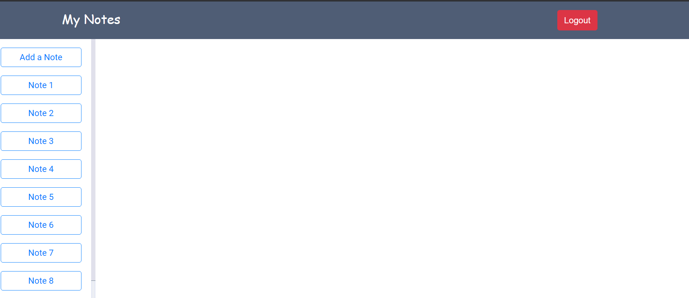
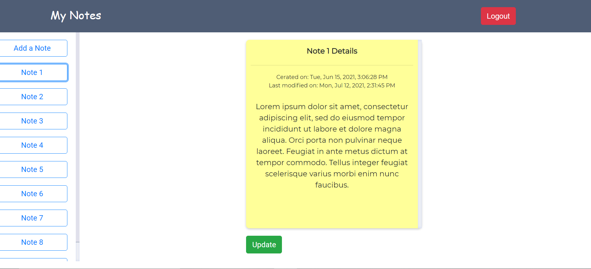
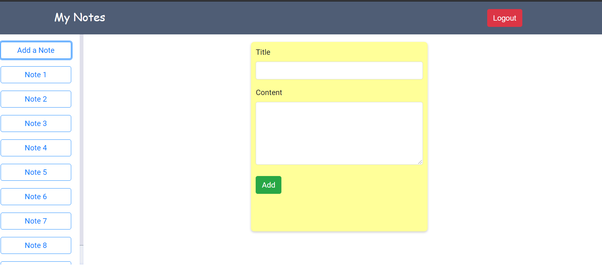
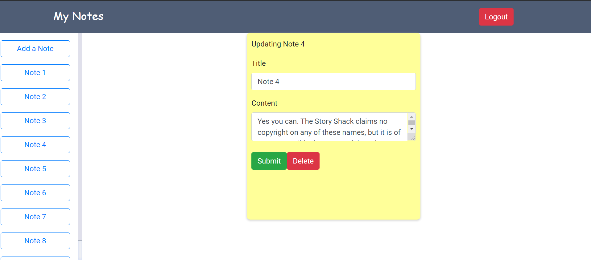

# NotesApp
An application to keep track of the notes and to do tasks built using Angular JS. 

To run the app in local computer follow the following steps 
1) clone the repo - git clone https://github.com/kushalt93/NotesApp.git  
2) cd into notes-app folder 
3) run the command - ng serve --host local.mylocal.org 

Sample UI: 
Home Page:  

display selected note: 

Add new note: 

Update/Delete note: 

Currently working on adding a backend to enable update and delete features. 

